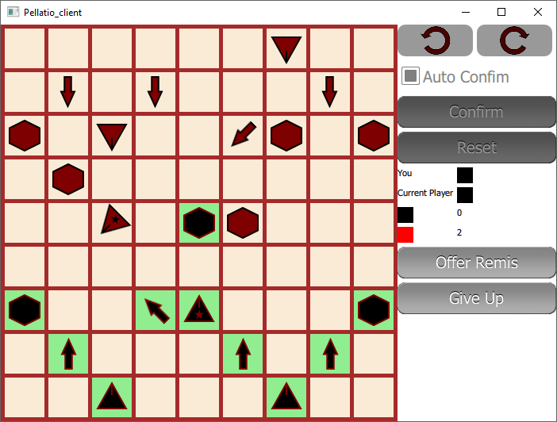

# Pellatio
Pellatio is a chess like strategy board game inventend by a friend of mine for his fantasy world Reven.

## Rules
Unlike normal chess, view direction and direction of attack are relevant for capturing pieces. Thus, rotation (by 45°) is a type of move.

### Movement
**Aggressors** (hexagonal) can move 1 field in any direction

**Phalangists** (arrows) can move 1 field forward, or rotate by 45°

**Cavalerists** (triangles) can move 1-2 fields forward or diagonally backwards, or rotate by up to 90°, or a mix of both (move+rotate, rotate+move, just move, just rotate)

**Generals** (triangles with star) behave like Cavalerists

### Parade
The 3 front facing fields of Phalangists, Cavalerists and Generals are their *parade* fields. This means if they are attacked from one of those fields, the *attacking* piece is captured.

An exception to this rule is the Phalangist. Its main purpose is to break through the parade of Cavalerists (and Generals).

An Aggressor has no parade, and can be attacked from any side. However, if an Aggressor attacks another Aggressor (no matter from where), the *attacking* Aggressor is captured.

### Flanking
If an enemy piece is flanked by pieces either horizontally, vertically or diagonally, it is captured. With this, multiple pieces can be captured at once.

It is not allowed to move into a flanked position, except, by moving there the flanking position is resolved by flanking one of the pieces.

However, a Cavalerist (and General) can move through a flanked position.

### End of Game
The game ends when a General is captured. This doesn't automatically define a winner, though.

The captured pieces have different values (Ag=1, Ph=3, Ca=6, Ge=9). The player who scored more points wins. On a draw, the player who captured the General wins
